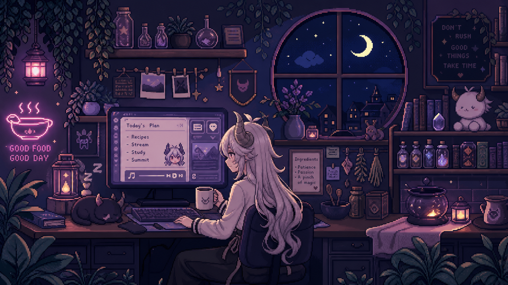

# 👨🏻‍💻 Hi, I'm Elvis ᯓ★

## 👋 About Me

🎓 &nbsp; Back-end development student with a Cloud focus at [NBI/Handelsakademin](https://www.nbi-handelsakademin.se) 
🔆 &nbsp; Aiming to be the best in my field — I tackle challenging problems head-on 
👨🏻‍🍳 &nbsp; Former chef doing a 180° pivot into the tech industry 
💻 &nbsp; Currently building APIs and full-stack apps with Clean Architecture and cloud-focused back-end systems 
🌐 &nbsp; Let's connect on [LinkedIn](https://www.linkedin.com/in/elvis-nilsson-6852892b3)

---

## 🎮 Outside the Code

✩♬ &nbsp; Piano sessions to clear my head — lately mixing in some guitar solos too 
🎮 &nbsp; Competitive gaming when the brain needs a reset (Hunt: Showdown, Rocket League, Valorant, CS2) 
🏋🏻‍♂️ &nbsp; Hitting the gym so I don't look like a sack of potatoes when I code 
🌱 &nbsp; Gardening — currently planning a raised-bed vegetable setup for the season

---

## 🧰 My Stack

### Languages

### Frameworks & Libraries

### Databases

### DevOps & Cloud

### Tools & Environment

### Architecture & Concepts

---

## 🚀 Currently Building

**[Inkpact](https://github.com/ElvisNilssonDev/Inkpact)** — A freelance contract platform built with Clean Architecture, CQRS, MediatR, JWT auth and PostgreSQL. Demonstrates real-world patterns: domain events, atomic transactions across multiple aggregates, generic repositories, pipeline behaviors and role-based authorization.

---

*Good food, good day. Don't rush — good things take time.*

